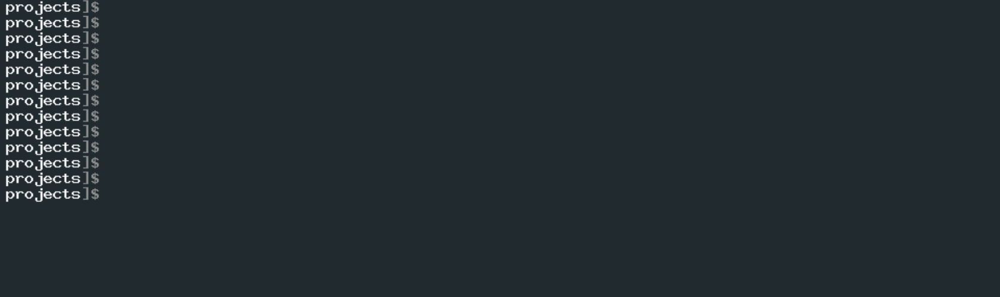

# url-completion



## What is it?

`url-completion` is a collection of scripts that modify common commands to allow for URL tab completion in bash.

## How does it work?

The core functionality comes from a `__url_completion` function defined in [./url_completion.sh](./url_completion.sh). The function simply echoes out everything defined in a file thats referenced by `$__url_completion_file`. If this variable is not set, the `__url_completion` function will use `$HOME/.url_history` by default.

Next, it contains install scripts that modify startup scripts such as `.bashrc` or `.bash_profile` to overwrite common command completion scripts to use the `__url_completion` function in certain cases. For example, the git command completion allows you to do:

```sh
git pull https://github<TAB><TAB>
```

and it will show you all urls that exist in the url history file that match `https://github`. This works because the install script modifies the git command completion code and inserts the `__url_completion` function in certain git completion functions.

## Installation

Clone the repo and cd into it:

```sh
git clone https://github.com/nikita-skobov/url-completion
cd url-completion
```

You will want to create a url history file somewhere. For simplest use, you can do:

```sh
# replace the below url with whatever you want
echo "https://github.com/nikita-skobov" > $HOME/.url_history
```

Alternatively, create this file somewhere else, and then make sure to edit your startup script and add this line:

```sh
# put this inside $HOME/.bashrc or $HOME/.bash_profile
__url_completion_file="/absolute/path/to/your/file"
```

Next, you can install the `command_completion/` scripts in two ways:

1. Install everything within `command_completions/`
    - There is a script `install_commands.sh` in the root of this repo which will iterate through, and install every command completion script in the `command_completions/` directory.
2. Install individual command completion scripts
    - The `command_completions/` directory contains subdirectories for each command completion script that has been created so far.
    - simply run the `install.sh` script for the command that you wish to add url completion for.
    - If you do not see one that you want to use, feel free to make one and send a pull request :)

For a full list of command completion scripts, see the [./command_completions](./command_completions/README.md) directory

## The url history file

The url history file should contain a single url per line. it doesn't even have to contain urls, any line that is included in this file will be used for tab completion for the commands that `url_completion` was installed for.

Most users type urls in the command line all the time. If you want to easily output a list of urls from your history, there is a script provided called `get_urls_from_history.sh`.

This script is meant to be sourced because it uses the history command, which requires it to be ran in an interactive shell (ie: not as a script). So if you do:

```sh
source ./get_urls_from_history.sh
```

it will echo out any url that it finds from your history. Then, if you want to simply append your url history with the entire output, you can do:

```sh
source ./get_urls_from_history.sh >> $HOME/.url_history

# or if your __url_completion_file variable is defined:
source ./get_urls_from_history.sh >> $__url_completion_file
```

Alternatively, you can just manually pick the urls you wish to save from the output of `get_urls_from_history.sh`

